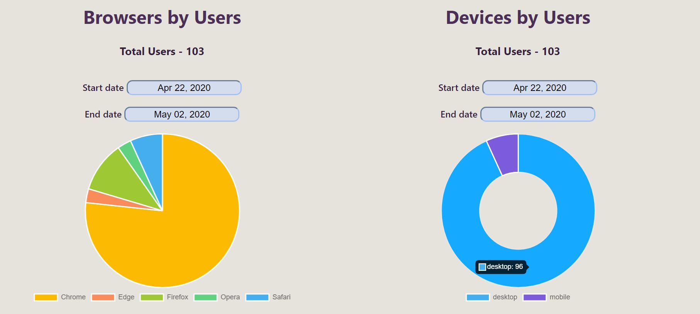

# Custom Facebook and Google Analytics Dashboard

Custom Facebook and Google Analytics Dashboard based on Facebook Graph API and Google Analytics Reporting API v4 with OAuth2, charts and tables.

<p float="left">
    
    
    
    
    
    
</p>

## Technologies used

- [React.js](https://reactjs.org/)
- [Facebook Graph api](https://developers.facebook.com/docs/graph-api)
- [Google Analytics API](https://developers.google.com/analytics/devguides/reporting/core/v4)

## Run the app locally

1. Clone this repo
2. Add your CLIENT_ID into .env file:
    REACT_APP_CLIENT_ID='YOUR_CLIENT_ID'
3. Run ```npm install```
4. Run ```npm start```

# FB-and-Google-dashboard
